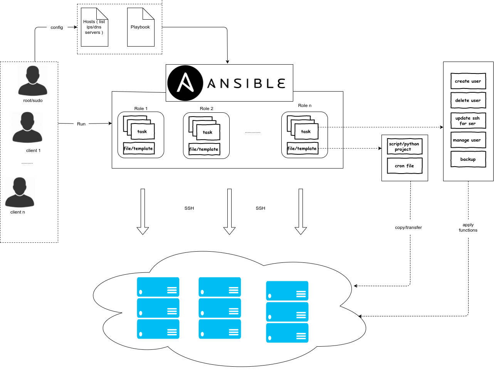

..
   Author: Cong Quan<cqshinn92@gmail.com>
   Maintainer: Cong Quan<cqshinn92@gmail.com>

Architechture
=============

Intro
-----

This project 's used for automatically running functions ( backup, create user , etc ) via configuration instead directly remote to server and config by manual 
and can use for multi users on one or many servers. . It'll use `Ansible <https://www.ansible.com/>`, 
which's a automation configuration tool allow provisioning, config, deployment via code ( infrasture as code ).

